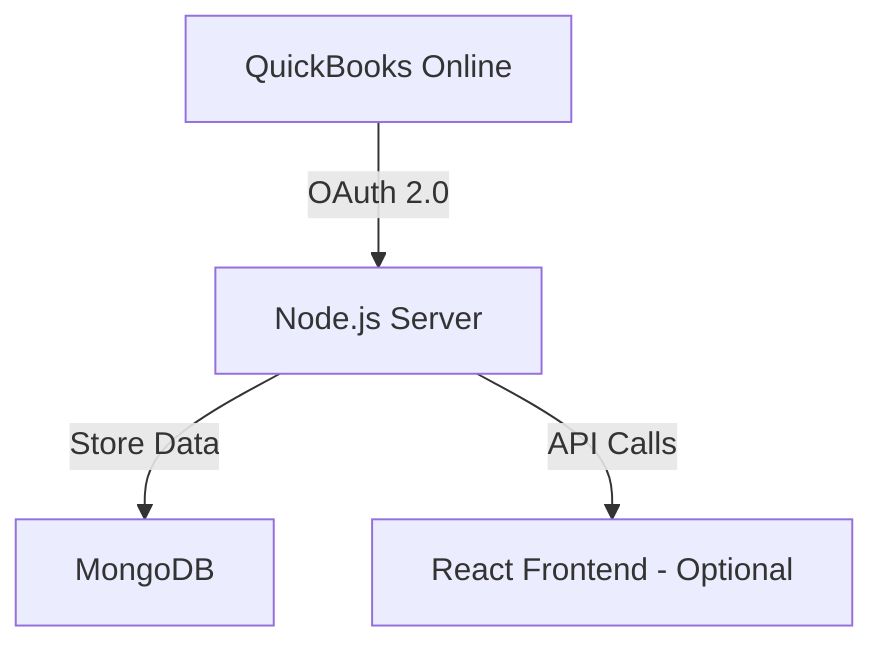

# MeruAssignment

# QuickBooks Online Integration API

A backend service for synchronizing QuickBooks Online accounting data with MongoDB, built with the MERN stack.

# Features

1. OAuth 2.0 Authentication
2. Chart of Accounts Sync → `chartOfAccounts` collection
3. Payees Management** (Vendors + Customers in single `payees` collection)
4. Transaction Sync** (Uncategorized purchases/deposits only)
5. Duplicate Data Handling
6. MongoDB Data Storage

## System Architecture

#Setup Instructions

#Prerequisites

Node.js v16+
MongoDB (Local or Atlas)
QuickBooks Developer Account

#Installation

Clone repository:

git clone https://github.com/your-repo/quickbooks-integration.git

cd quickbooks-integration/server

Install dependencies:

npm install

Create .env file:

QB_CLIENT_ID=ABhQGJ8mqOxNzSlsHsW5aC0jocViP4T1lIe7wAWpVRj92AXFoH

QB_CLIENT_SECRET=your_client_secret

QB_REDIRECT_URI=http://localhost:3000/callback

MONGODB_URI=mongodb://localhost:27017/qboIntegration

NODE_ENV=development

# Start the server:

node server.js

# API Endpoints

# Endpoint	Method	Description

1. /auth/qbo	GET	Initiate QuickBooks OAuth flow
2. /callback	GET	OAuth callback handler
3. /sync/accounts	GET	Sync Chart of Accounts
4. /sync/payees	GET	Sync Vendors & Customers
5. /sync/transactions	GET	Sync Uncategorized Transactions

Usage Examples

# Start Authentication Flow:

http://localhost:3000/auth/qbo

# Sync Data After Authentication:

# Sync accounts
curl "http://localhost:3000/sync/accounts?access_token=YOUR_TOKEN&realmId=YOUR_REALM_ID"

# Sync payees
curl "http://localhost:3000/sync/payees?access_token=YOUR_TOKEN&realmId=YOUR_REALM_ID"

# Sync transactions
curl "http://localhost:3000/sync/transactions?access_token=YOUR_TOKEN&realmId=YOUR_REALM_ID"

# Technical Highlights

1. Modular Architecture: MVC pattern with separate routes, controllers, and services

2. Error Handling: Comprehensive error catching and logging

3. Data Validation: Schema validation for MongoDB models

4. Duplicate Prevention: Custom ID generation for missing QBO IDs

# Troubleshooting

1. Issue: E11000 duplicate key error
2. Solution: The system automatically handles this by:

Dropping problematic indexes

Generating missing IDs

Using upsert operations

Issue: QuickBooks API rate limiting
Solution: Implemented automatic retry logic with exponential backoff

# Future Enhancements

1. Add React frontend dashboard

2. Implement automated daily sync

3. Add webhook support for real-time updates
